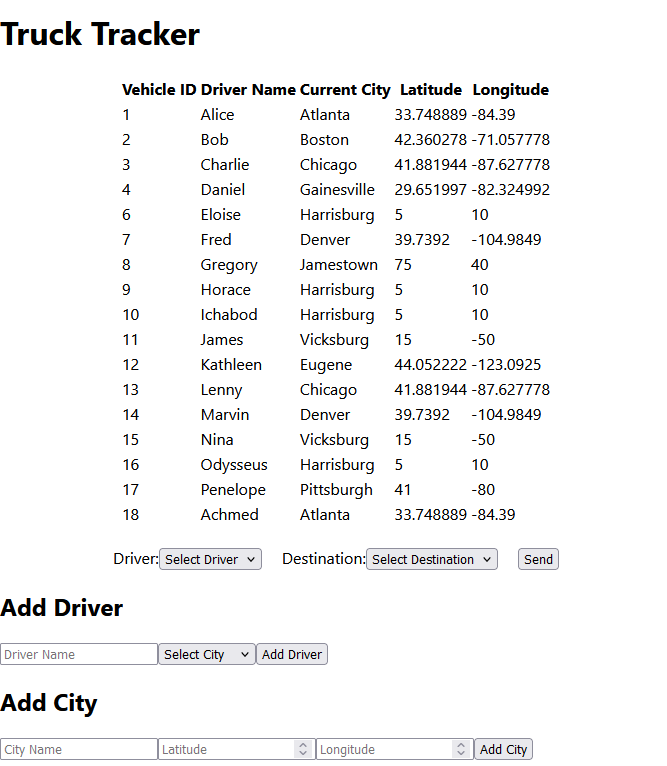

# truck-tracker

## Description
A basic tool for creating, moving, and tracking company drivers and trucks.

This project runs on PostgreSQL, Express, React, and Node (PERN).

## Installation
1. Clone the repository
2. Install `Node.js` and `PostgreSQL`
3. Install dependencies: `npm install`
4. Set up PostgreSQL database:

    a. Initialize PostgreSQL database
    
    b. Populate database using `psql`: connect to server, then run `\i truck-tracker/server/db/init.sql`
    
    c. Update `template_dotenv` file with DB connection info.
5. Run the server: `cd server; npm run dev`
6. Start the client: `cd client; npm start`

## Usage
### Add driver
Enter the driver name and a starting city, then click `Add Driver`.

### Add city
Enter the city name and coordinates, then click `Add City`.

### Move truck
Select the driver to move and the destination city, then click `Send`.

## Contributing
Contributions are always welcome.

- Fork the repository
- Create a new branch
- Submit a pull request 
